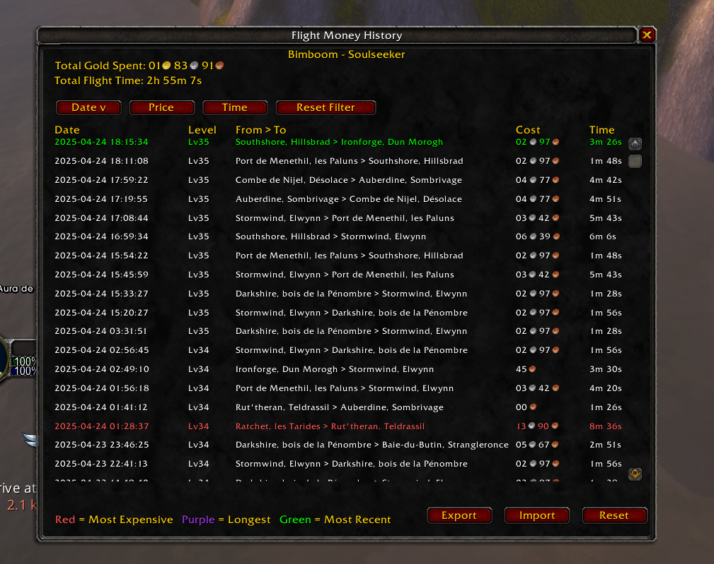

# ✈️ FlightMoney

Track how much gold and time your character spends on flight paths in World of Warcraft.

This is mostly a stupid idea I had while playing World of Warcraft Classic Hardcode.

I wondered, how much gold we spend on flight? And how much time.

Now we are able to know.

## 🔍 Features

- Tracks total flight gold spent
- Tracks total flight time
- Detailed sortable flight history
- Export/import your flight data
- Works with both **Classic** and **Retail**

## 🖥️ Screenshot

> _Sortable flight log with export & import support:_



## 📦 Installation

1. Download the addon:

   - From [CurseForge](https://www.curseforge.com/wow/addons/flightmoney) _(link once live)_
   - Or from the [Releases](https://github.com/YourGitHubUser/FlightMoney/releases)

2. Extract the folder `FlightMoney` into:

   - `\World of Warcraft\_classic_era_\Interface\AddOns\` (for Classic)
   - `\World of Warcraft\_retail_\Interface\AddOns\` (for Retail)

3. Restart the game or reload the UI (`/reload`)

## 🧰 Commands

```
/flightmoney stats
/fm stats
Open the stats
/flightmoney help
/fm help
Displays help in chat.
```

Opens the FlightMoney UI.

## 🗂️ Export & Import

- Export your data to share between machines if you have multiple (one per character)
- Import with a single paste and button click

## 🛠️ Compatibility

- **Classic Era**
- **Retail (The War Within and beyond)**

## 💬 Feedback & Issues

Feel free to report bugs or request features on the [GitHub Issues page](https://github.com/SebbyBE/FlightMoney/issues).

## 📄 License

Licensed under the [GPLv3 License](LICENSE).

---
